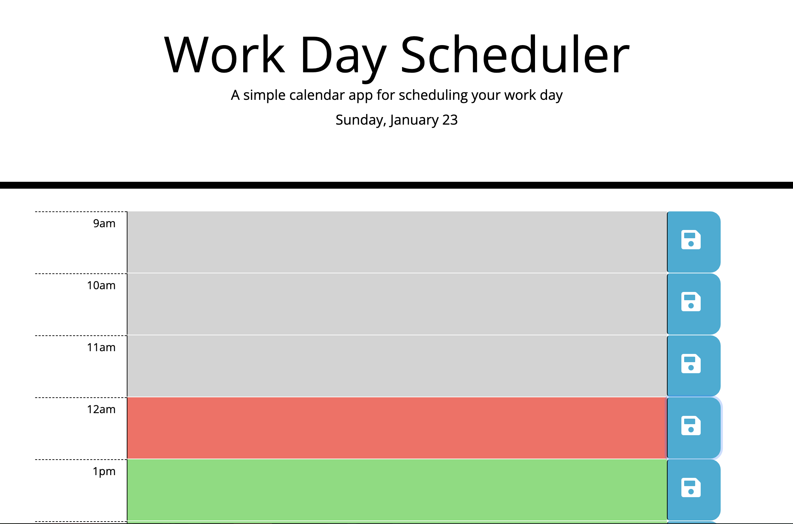

# Work Day Scheduler

## How it works 
* This is a program where you can input tasks for a given hour.
* tasks blocks are color coded to show you which is task is current(red), past(gray), and in the future(green). 
* The current date is displayed on the top of the page. 
* All items are saved in local storage if saved button is clicked. 
* Erase the content and click the save button to erase a task. 
## Link
https://abarragan89.github.io/daily-work-scheduler/